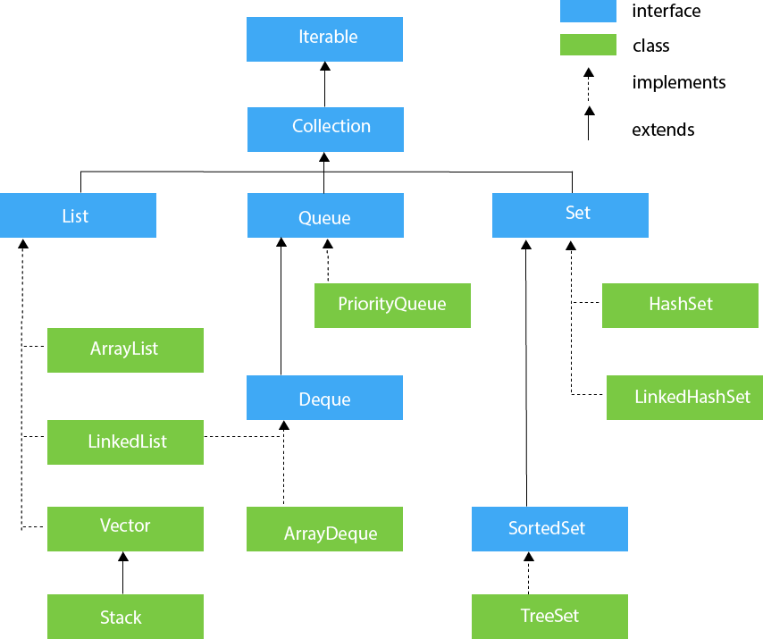

# Chuwa Q&A

# What is agile methodologies  in software development and it is different stage ?

Agile methodologies in software development are flexible, iterative approaches that focus on delivering small, incremental updates to software. They emphasize collaboration, customer feedback, and adaptability to changes throughout the development process.

**Stages of Agile Development:**

1. **Concept/Planning**: Identify project goals, key features, and prioritize tasks.
2. **Design**: Outline the system architecture, user stories, and prepare for development.
3. **Development**: Build the software in iterative cycles called sprints (typically 1–4 weeks).
4. **Testing**: Continuously test during and after development to ensure quality.
5. **Deployment**: Release the functional product increment to users.
6. **Review/Feedback**: Collect user feedback to improve future iterations.
7. **Maintenance**: Ongoing updates and bug fixes after the product is live.

# What is Test-Driven Development (TDD)?

Test-Driven Development (TDD) is a software development process where tests are written before the actual code. This ensures that the code is built to meet specific requirements and is free from errors through a repetitive, incremental process.

### TDD Cycle:

1. **Write a Test**
    - Start by writing a test for a small piece of functionality that hasn't been implemented yet.
2. **Run the Test**
    - The test will initially fail since the feature is not yet developed.
3. **Write Code**
    - Write just enough code to pass the test.
4. **Run Tests Again**
    - Run all tests to ensure the new code works without causing issues in existing functionality.
5. **Refactor**
    - Refactor or improve the code while maintaining passing tests.
6. **Repeat**
    - Continue this cycle for each new feature or functionality.

# What are the four OOP concepts in Java?

The four key OOP concepts in Java are:

1. **Encapsulation**
    - Bundling data and methods into a single unit (class) and restricting access to some of its components.
2. **Inheritance**
    - Allowing a class to inherit properties and behaviors from another class.
3. **Polymorphism**
    - Allowing objects to be treated as instances of their parent class, enabling method overriding and overloading.
4. **Abstraction**
    - Hiding complex implementation details and showing only the essential features.

# Collections in Java ?



# What is Concurrent Hash Map in Java ?

**`ConcurrentHashMap`** in Java is a thread-safe implementation of the `Map` interface that allows concurrent access by multiple threads without the need for external synchronization. It is part of the **`java.util.concurrent`** package, introduced in Java 1.5, and is designed to allow high-performance, concurrent access to key-value pairs in a multi-threaded environment.

### Difference Between `HashMap`, `Hashtable`, and `ConcurrentHashMap`:

| Feature | `HashMap` | `Hashtable` | `ConcurrentHashMap` |
| --- | --- | --- | --- |
| Thread-Safe | No | Yes (Synchronized) | Yes (Segment Locking) |
| Null Keys/Values | Allows one `null` key, many `null` values | Does not allow `null` keys or values | Does not allow `null` keys or values |
| Synchronization | No | Synchronizes entire map | Synchronizes at segment level |
| Performance | Fast in single-threaded apps | Slow in multithreaded apps | High performance in multithreaded apps |
| Fail-Safe Iterator | No (throws `ConcurrentModificationException`) | No (throws `ConcurrentModificationException`) | Yes (Weakly consistent) |

# Microservices Architecture: Advantages vs. Disadvantages

### **Advantages**:

- **Scalability**: Services can scale independently.
- **Independent Deployment**: Faster, isolated deployments.
- **Fault Isolation**: Service failures don't affect the entire system.
- **Flexibility**: Choose the right technology for each service.
- **Parallel Development**: Teams can work on services simultaneously.
- **Faster Time-to-Market**: Quicker release of features.
- **Modularization**: Better code structure and maintainability.
- **Security**: Granular security control.

### **Disadvantages**:

- **Complexity**: Managing a distributed system is challenging.
- **Data Management**: Handling distributed data and consistency is difficult.
- **Communication Overhead**: Network communication adds latency and failure points.
- **Deployment/Monitoring Overhead**: Multiple services need sophisticated management.
- **Testing Challenges**: Difficult to test across multiple services.
- **Security**: Increased attack surface due to network-based communication.
- **Costs**: Higher infrastructure and operational costs.

# How to deploy microservice

### Overview of Deployment Options

1. **Deploy on Local Machine** (simple setup).
2. **Deploy using Docker** (containerization).
3. **Deploy on Kubernetes** (for orchestration and scaling).
4. **Deploy on Cloud (AWS, Azure, Google Cloud)**.
5. **Deploy on a Traditional Web Server** (Tomcat, etc.).

# Explain Circuit breaker

### Circuit Breaker Pattern: Explained

The **Circuit Breaker Pattern** is a **resilience pattern** used in microservices architecture to prevent cascading failures and improve fault tolerance when services communicate with each other. It is typically implemented in distributed systems to handle faults, timeouts, and errors in downstream services (like APIs, databases, or microservices).

Here’s an example using **Resilience4j** in a Spring Boot microservice:

```java
import io.github.resilience4j.circuitbreaker.annotation.CircuitBreaker;
import org.springframework.stereotype.Service;
import org.springframework.web.client.RestTemplate;

@Service
public class MyService {

    private final RestTemplate restTemplate;

    public MyService(RestTemplate restTemplate) {
        this.restTemplate = restTemplate;
    }

    @CircuitBreaker(name = "myService", fallbackMethod = "fallbackResponse")
    public String callExternalService() {
        // Call external service
        return restTemplate.getForObject("http://external-service/api/data", String.class);
    }

    // Fallback method if the external service is down
    public String fallbackResponse(Throwable throwable) {
        return "Fallback response: Service is currently unavailable";
    }
}

```

# SQL vs NoSQL

### **Summary: SQL vs. NoSQL**

| **Aspect** | **SQL (Relational Databases)** | **NoSQL (Non-Relational Databases)** |
| --- | --- | --- |
| **Data Model** | Relational (tables, rows, columns) | Document-based, key-value, wide-column, or graph-based |
| **Schema** | Fixed schema (predefined) | Dynamic schema (schema-less) |
| **Scalability** | Vertical scaling (harder to scale horizontally) | Horizontal scaling (easy to scale across multiple servers) |
| **Consistency** | Strong consistency (ACID transactions) | Eventual consistency (BASE), though some support ACID at the document level |
| **Query Language** | SQL (Structured Query Language) | No standard query language (depends on database type) |
| **Performance** | Optimized for complex queries, but slower for large datasets | Optimized for fast reads/writes, especially with large datasets |
| **Use Cases** | Traditional applications, financial systems, eCommerce | Big data, real-time applications, social media, content management |
| **Flexibility** | Rigid, predefined schema | Highly flexible, dynamic data models |
| **Examples** | MySQL |  |

# RESTful API vs. GraphQL

### Summary: REST vs. GraphQL

| Feature | **REST** | **GraphQL** |
| --- | --- | --- |
| **Data Fetching** | Multiple endpoints, risk of over/under-fetching | Single endpoint, clients request specific data |
| **Flexibility** | Fixed endpoints and structure | High flexibility in data |

# Can you tell me some Java 8 new features ?

 

### 1. **Lambda Expressions**

### Example:

```java
// Traditional way (before Java 8)
Runnable runnable = new Runnable() {
    @Override
    public void run() {
        System.out.println("Hello, world!");
    }
};

// Using Lambda Expression (Java 8)
Runnable lambdaRunnable = () -> System.out.println("Hello, world!");

```

**Benefits**:

- Reduced verbosity.
- Improved readability.
- Functional programming capability.

---

### 2. **Functional Interfaces**

A **functional interface** is an interface that has exactly one abstract method. Lambda expressions can be used to implement these interfaces. Java 8 introduced several built-in functional interfaces under the `java.util.function` package, such as `Function`, `Consumer`, `Supplier`, `Predicate`, etc.

### Example:

```java
@FunctionalInterface
interface MyFunctionalInterface {
    void doWork();
}

public class LambdaDemo {
    public static void main(String[] args) {
        MyFunctionalInterface work = () -> System.out.println("Work done!");
        work.doWork();
    }
}

```

**Built-in Functional Interfaces**:

- **`Consumer<T>`**: Represents an operation that takes a single input argument and returns no result.
- **`Supplier<T>`**: Represents a supplier of results.
- **`Function<T, R>`**: Represents a function that takes one argument and produces a result.
- **`Predicate<T>`**: Represents a boolean-valued function of one argument.

---

### 3. **Streams API**

The **Streams API** provides a functional approach to processing sequences of elements (collections) in a declarative way. It allows you to perform operations like filtering, mapping, reducing, etc., on a collection of data in a more readable and optimized manner.

### Example:

```java
import java.util.Arrays;
import java.util.List;

public class StreamDemo {
    public static void main(String[] args) {
        List<Integer> numbers = Arrays.asList(1, 2, 3, 4, 5, 6);

        // Using Stream API to filter even numbers and print them
        numbers.stream()
               .filter(n -> n % 2 == 0)
               .forEach(System.out::println);
    }
}

```

**Key Methods in Streams API**:

- **`filter(Predicate)`**: Filters elements based on a condition.
- **`map(Function)`**: Transforms elements using a mapping function.
- **`forEach(Consumer)`**: Performs an action on each element of the stream.
- **`collect(Collectors)`**: Accumulates elements into a collection (e.g., `List`, `Set`).
- **`reduce(BinaryOperator)`**: Reduces the elements of the stream to a single value.

---

### 4. **Default Methods in Interfaces**

Java 8 allows interfaces to have **default methods** (also known as defender methods), which are methods that have a default implementation. This allows adding new functionality to interfaces without breaking the existing implementations.

### Example:

```java
interface MyInterface {
    void doWork();

    // Default method
    default void printDefault() {
        System.out.println("Default method in interface");
    }
}

public class DefaultMethodDemo implements MyInterface {
    @Override
    public void doWork() {
        System.out.println("Doing work");
    }

    public static void main(String[] args) {
        DefaultMethodDemo demo = new DefaultMethodDemo();
        demo.doWork();
        demo.printDefault();  // Calls default method
    }
}

```

**Benefit**:

- Backward compatibility: Existing interfaces can be extended without forcing all implementing classes to provide an implementation.

---

### 5. **Optional Class**

The **Optional** class was introduced to handle null values more effectively and avoid `NullPointerException`. It represents a container that may or may not contain a non-null value.

### Example:

```java
import java.util.Optional;

public class OptionalDemo {
    public static void main(String[] args) {
        Optional<String> optional = Optional.ofNullable(null);

        // Using Optional to provide a default value
        String result = optional.orElse("Default Value");
        System.out.println(result);  // Output: Default Value
    }
}

```

**Common Methods**:

- **`isPresent()`**: Checks if a value is present.
- **`ifPresent(Consumer)`**: Performs an action if a value is present.
- **`orElse(T other)`**: Returns the value if present, otherwise returns `other`.
- **`orElseGet(Supplier)`**: Returns the value if present, otherwise invokes a Supplier.
- **`map(Function)`**: Transforms the value if present.

# Difference between Abstract vs interface ?

In Java, both **abstract classes** and **interfaces** are used to achieve abstraction, which allows you to define the blueprint of a class or method without providing a complete implementation. However, they have different rules, use cases, and capabilities. Below is a detailed comparison between **abstract classes** and **interfaces**:

**An interface can't implement but can extend any number of interfaces**. Interface fields can only be public static final (which is implicit) but abstract can have any kind of field. Interface methods can only be public (which is implicit), static is optional. Abstract can have any kind of method.

### **Summary: Abstract Class vs. Interface**

| Feature | **Abstract Class** | **Interface** |
| --- | --- | --- |
| **Methods** | Can have both abstract and concrete methods | Can have abstract, default, and static methods |
| **Fields** | Can have instance variables and constants | Can only have `public static final` constants |
| **Constructor** | Can have constructors | Cannot have constructors |
| **Access Modifiers** | Methods can have any access modifier | Methods are implicitly `public` |
| **Multiple Inheritance** | Supports single inheritance (cannot extend multiple classes) | Can implement multiple interfaces |
| **Use Case** | When classes share common functionality | When unrelated classes need to share behavior |
| **Inheritance Type** | "is-a" relationship (class hierarchy) | "can-do" relationship (capability) |
| **When to Use** | When you want to share common code and provide default behavior | When you need a contract or multiple behaviors |

# Difference between Heap vs stack ?

### **Summary: Heap vs. Stack**

| **Feature** | **Heap** | **Stack** |
| --- | --- | --- |
| **Memory Type** | Dynamic memory allocation | Static memory allocation |
| **Stored Data** | Objects, instance variables | Local variables, method calls, reference variables |
| **Access Speed** | Slower due to dynamic allocation | Faster due to LIFO structure |
| **Size** | Larger (configurable) | Smaller (fixed size, per thread) |
| **Thread Safety** | Not thread-safe (requires synchronization) | Thread-safe (each thread has its own stack) |
| **Managed By** | Garbage Collector | Automatically managed |
| **Lifetime of Data** | Exists as long as referenced | Exists only within the method’s execution |
| **Error** | `OutOfMemoryError` | `StackOverflowError` |
| **Use Case** | Storing objects, instance variables | Storing local variables, method execution |

# Garbage Collection in Java ?

### How Does Garbage Collection Work in Java?

Java garbage collection follows these steps:

1. **Reference Counting** (used historically but not often in modern JVMs):
    - Each object has a reference count that tracks how many active references point to it.
    - When the reference count drops to zero, the object becomes eligible for garbage collection.
    - However, this approach has problems with **circular references**, where two objects reference each other but are no longer referenced by any active object.
2. **Tracing Reachability**:
    - Most modern JVM garbage collectors use **reachability analysis** to determine whether an object is still in use.
    - Objects that can be reached from the **root** (such as static variables, local variables in active methods, or live threads) are considered "reachable."
    - Any object that cannot be reached from these roots is considered **garbage** and can be collected.
3. **Mark and Sweep Algorithm**:
    - The **Mark and Sweep** algorithm is a common garbage collection technique:
        1. **Mark**: The garbage collector traverses all live objects starting from root references and marks all reachable objects.
        2. **Sweep**: After marking the reachable objects, the garbage collector scans the heap and reclaims memory from unmarked (unreachable) objects.
4. **Generational Garbage Collection**:
    - Modern JVMs use **generational garbage collection**, which divides the heap into different regions based on the **age** of objects:
        - **Young Generation**: Where new objects are created. Most objects die young and are quickly reclaimed.
        - **Old Generation (Tenured Space)**: Objects that survive multiple garbage collection cycles are promoted to the Old Generation. These objects are collected less frequently.
        - **Permanent Generation (Metaspace in Java 8 and later)**: Used to store class metadata and static fields.
    - The idea is that young objects are collected more frequently because they tend to become garbage quickly, whereas older objects are collected less frequently.

# Multi-Threading in Java ?

### Creating Threads in Java

There are two main ways to create threads in Java:

1. **Extending the `Thread` class**:
    - By subclassing the `Thread` class and overriding its `run()` method, you can define the code that runs in the thread.
2. **Implementing the `Runnable` interface**:
    - By implementing the `Runnable` interface and defining the `run()` method, you can pass the `Runnable` instance to a `Thread` object.

### 1. **Creating a Thread by Extending `Thread` Class**

In this approach, you create a new thread by extending the `Thread` class and overriding its `run()` method.

### Example:

```java

class MyThread extends Thread {
    @Override
    public void run() {
        System.out.println("Thread is running: " + Thread.currentThread().getName());
    }
}

public class Main {
    public static void main(String[] args) {
        MyThread thread1 = new MyThread();
        MyThread thread2 = new MyThread();

        thread1.start();  // Start the thread (calls the run() method)
        thread2.start();
    }
}

```

In this example:

- `thread1.start()` starts a new thread, which will execute the `run()` method defined in the `MyThread` class.
- The `start()` method starts the thread and invokes the `run()` method on a new call stack. If you call `run()` directly, it will not start a new thread but will be executed in the current thread.

---

### 2. **Creating a Thread by Implementing `Runnable` Interface**

Implementing the `Runnable` interface is the preferred approach for multithreading because Java supports **single inheritance**, and this method allows you to extend other classes.

### Example:

```java
class MyRunnable implements Runnable {
    @Override
    public void run() {
        System.out.println("Runnable thread is running: " + Thread.currentThread().getName());
    }
}

public class Main {
    public static void main(String[] args) {
        MyRunnable myRunnable = new MyRunnable();
        Thread thread1 = new Thread(myRunnable);
        Thread thread2 = new Thread(myRunnable);

        thread1.start();
        thread2.start();
    }
}

```

In this example:

- `Thread thread1 = new Thread(myRunnable);` creates a new thread by passing the `Runnable` object to the `Thread` constructor.
- The `start()` method starts the thread and invokes the `run()` method of the `Runnable` implementation.

### 3. **Using Lambda Expressions for Threads (Java 8 and Later)**

In Java 8 and later, you can use **lambda expressions** to create threads in a more concise way, especially when implementing the `Runnable` interface.

### Example:

```java

public class Main {
    public static void main(String[] args) {
        Runnable task = () -> {
            System.out.println("Lambda thread is running: " + Thread.currentThread().getName());
        };

        Thread thread1 = new Thread(task);
        Thread thread2 = new Thread(task);

        thread1.start();
        thread2.start();
    }
}

```

# Can you explain Synchronization in multi-threading ?

### Synchronization

When multiple threads share resources (like variables or objects), it can lead to **data inconsistency** or **race conditions**. Java provides **synchronization** to control access to shared resources and ensure thread safety.

- **Synchronized Blocks**: A block of code that can only be executed by one thread at a time.
- **Synchronized Methods**: A method that can only be executed by one thread at a time.

### Example of Synchronized Method:

```java
java
Copy code
class Counter {
    private int count = 0;

    public synchronized void increment() {
        count++;
    }

    public int getCount() {
        return count;
    }
}

public class Main {
    public static void main(String[] args) throws InterruptedException {
        Counter counter = new Counter();

        Runnable task = () -> {
            for (int i = 0; i < 1000; i++) {
                counter.increment();
            }
        };

        Thread thread1 = new Thread(task);
        Thread thread2 = new Thread(task);

        thread1.start();
        thread2.start();

        thread1.join();
        thread2.join();

        System.out.println("Final count: " + counter.getCount());
    }
}

```

In this example, the `increment()` method is synchronized, ensuring that only one thread can increment the count at a time, thus preventing race conditions.

# What is Volatile Keyword ?

### Volatile Keyword

The **`volatile`** keyword in Java ensures that the value of a variable is always read from the main memory, rather than from a thread's local cache. This is useful in a multithreaded environment where one thread writes to a variable and another thread reads from it.

### Example:

```java

class SharedObject {
    private volatile boolean running = true;

    public void stopRunning() {
        running = false;
    }

    public boolean isRunning() {
        return running;
    }
}

```

In this example, `volatile` ensures that updates to the `running` variable are visible to all threads.

# What is a Daemon Thread?

A **daemon thread** in Java is a low-priority thread that runs in the background and performs tasks like garbage collection, background monitoring, or cleanup. These threads do not prevent the JVM from exiting; once all **non-daemon** threads in a program have finished, the JVM will terminate, even if there are daemon threads still running.

Daemon threads are typically used for services or background tasks that should not block the termination of the program.

### Key Characteristics of Daemon Threads:

- **Background tasks**: Daemon threads typically perform background tasks such as garbage collection, log writing, etc.
- **JVM shutdown**: If only daemon threads are left running, the JVM will terminate them and shut down. Non-daemon threads must complete before the JVM shuts down.
- **Example of daemon threads**: Java's garbage collector thread is a daemon thread.

```java
public class DaemonThreadExample {
    public static void main(String[] args) {
        Thread nonDaemonThread = new Thread(() -> {
            System.out.println("Non-daemon thread running...");
            try {
                Thread.sleep(5000);
            } catch (InterruptedException e) {
                e.printStackTrace();
            }
            System.out.println("Non-daemon thread finished.");
        });

        Thread daemonThread = new Thread(() -> {
            System.out.println("Daemon thread running...");
            try {
                Thread.sleep(10000);  // Simulating some long-running background task
            } catch (InterruptedException e) {
                e.printStackTrace();
            }
            System.out.println("Daemon thread finished.");
        });

        // Set the thread as daemon before starting
        daemonThread.setDaemon(true);

        // Start both threads
        nonDaemonThread.start();
        daemonThread.start();

        System.out.println("Main thread finished.");
    }
}

```

# What is Agile ?

**Agile methodology** is a modern approach to software development that emphasizes **iterative** development, **collaboration**, and the ability to respond quickly to changes. Unlike traditional waterfall methods, Agile promotes flexibility, continuous improvement, and customer feedback throughout the development process. Agile is a **framework** under which several methodologies, like **Scrum** and **Kanban**, operate, all focused on delivering small, incremental changes rather than one large project at the end.


# What is Scrum ?

Scrum is a management framework that teams use to self-organize tasks and work towards a common goal. It is a framework within which people can address complex adaptive problems while the productivity and creativity of delivering products are at the highest possible value. Scrum is a management framework that teams use to self-organize and work towards a common goal.

- Scrum allows us to develop products of the highest value while making sure that we maintain creativity and productivity.
- The iterative and incremental approach used in scrum allows the teams to adapt to the changing requirements.

# Silent features of Scrum

- Scrum is a light-weighted framework
- Scrum emphasizes self-organization
- Scrum is simple to understand
- Scrum framework helps the team to work together
- Lifecycle of Scrum

# What are some **Common Security Feature in Spring Security**?

### **Common Security Features in Spring Security**

1. **Password Encoding**:
    - Spring Security includes utilities for encoding passwords using algorithms like BCrypt.
    
    Example:
    
    ```java
    java
    Copy code
    @Bean
    public PasswordEncoder passwordEncoder() {
        return new BCryptPasswordEncoder();
    }
    
    ```
    
2. **Cross-Site Request Forgery (CSRF)**:
    - CSRF protection is enabled by default in Spring Security to prevent unauthorized commands being transmitted from a user that the web application trusts.
    
    Example:
    
    ```java
    
    http.csrf().disable();  // Disable CSRF protection (not recommended in production)
    
    ```
    
3. **CORS (Cross-Origin Resource Sharing)**:
    - Allows web applications to securely interact with resources on different domains.
    
    Example:
    
    ```java
    
    http.cors().and().csrf().disable();
    
    ```
    
4. **Session Management**:
    - Spring Security provides control over session management, including session timeouts, session fixation protection, and concurrent session control.
    
    Example:
    
    ```java
    
    http.sessionManagement()
        .sessionFixation().migrateSession();  // Prevent session fixation attacks
    
    ```
    
5. **Remember-Me Authentication**:
    - This feature allows users to stay logged in over multiple sessions by storing a cookie in the user's browser.
6. **OAuth2 and Social Login**:
    - Spring Security can be configured to integrate with third-party identity providers like Google, Facebook, or GitHub for authentication using OAuth2.
    
    Example:
    
    ```java
    
    @EnableWebSecurity
    public class SecurityConfig extends WebSecurityConfigurerAdapter {
        @Override
        protected void configure(HttpSecurity http) throws Exception {
            http
                .oauth2Login()
                .defaultSuccessUrl("/home")
                .failureUrl("/login?error=true");
        }
    }
    
    ```
    

# What is Unit test and how to do it in Spring ?

### **Tools for Unit Testing in Spring**

1. **JUnit**:
    - JUnit is the most popular framework for unit testing in Java.
    - With JUnit 5 (also known as **Jupiter**), it provides several annotations and assertions to help structure and verify test cases.
2. **Mockito**:
    - Mockito is a **mocking framework** that allows you to create mock objects and control the behavior of dependencies.
    - It is useful when you need to test components that have dependencies (like service classes calling external systems).
3. **Spring Test Framework**:
    - Spring provides a rich testing framework that simplifies testing components in isolation and in integration.
    - Annotations like `@WebMvcTest`, `@MockBean`, and `@SpringBootTest` help test Spring-specific components effectively.

**Unit Test for the Service Class**

```java
import org.junit.jupiter.api.Test;
import static org.junit.jupiter.api.Assertions.*;

public class CalculatorServiceTest {

    private CalculatorService calculatorService = new CalculatorService();  // No external dependencies

    @Test
    public void testAdd() {
        int result = calculatorService.add(2, 3);
        assertEquals(5, result, "2 + 3 should equal 5");
    }

    @Test
    public void testDivide() {
        int result = calculatorService.divide(10, 2);
        assertEquals(5, result, "10 / 2 should equal 5");
    }

    @Test
    public void testDivideByZero() {
        Exception exception = assertThrows(IllegalArgumentException.class, () -> {
            calculatorService.divide(10, 0);
        });

        assertEquals("Division by zero", exception.getMessage());
    }
}

```

**Unit Test with Mockito**

```java
import org.junit.jupiter.api.Test;
import org.mockito.InjectMocks;
import org.mockito.Mock;
import org.mockito.Mockito;
import org.mockito.MockitoAnnotations;

import static org.junit.jupiter.api.Assertions.assertEquals;
import static org.mockito.Mockito.when;

public class UserServiceTest {

    @Mock
    private UserRepository userRepository;

    @InjectMocks
    private UserService userService;

    @Test
    public void testFindUserById() {
        // Initialize mocks
        MockitoAnnotations.openMocks(this);

        // Prepare mock data
        User mockUser = new User(1L, "John Doe");
        when(userRepository.findById(1L)).thenReturn(Optional.of(mockUser));

        // Execute the service method
        User user = userService.findUserById(1L);

        // Verify the result
        assertEquals("John Doe", user.getName());
        assertEquals(1L, user.getId());
    }
}

```

# What are the limitation of Mokito ?

**Spying Real Objects**

- Mockito allows partial mocking through **spying** real objects, but this can be problematic. When you spy, the real object methods are called unless explicitly stubbed. This might not fully test real scenarios and can lead to fragile tests that don't reflect actual behavior.

**Limitations of Mockito:**

1. **Cannot Mock Static Methods**:
    - Mockito does not support mocking static methods. Use **PowerMockito** to mock static methods if necessary.
2. **Cannot Mock Constructors**:
    - Mockito can't mock object creation within constructors. PowerMockito can mock constructors, but it's discouraged.
3. **Cannot Mock Final Classes/Methods (Pre Mockito 2)**:
    - Before Mockito 2, mocking final classes/methods was not allowed. In Mockito 2+, it’s possible with extra configuration.
4. **Cannot Mock Private Methods**:
    - Mockito can't directly mock private methods. Refactor code or test via public methods.
5. **No Support for Mocking Enum Types**:
    - Mockito cannot mock enums. Use abstraction to make enums testable.
6. **Limited Support for `final`, `static`, or `private` Fields**:
    - Mockito cannot inject mocks into these fields. Use constructor or setter injection instead.
7. **Cannot Mock Objects Created Inside Methods**:
    - Mockito can't mock objects created within the method under test. Use dependency injection or factory patterns.
8. **Limited Interaction with Native Methods**:
    - Mockito can't mock native methods (JNI). Use wrappers for better testability.
9. **Limited Verification of Invocation Order**:
    - Use **InOrder** for simple verification, but complex scenarios are hard to manage.
10. **No Support for System Resources (e.g., I/O, hardware)**:
    - Mockito only mocks objects in the Java heap. Cannot mock system-level interactions directly.

# What is Hibernate Cache ?

### 1. **First-Level Cache (Session Cache)**

- **Scope**: First-level cache is **enabled by default** and is associated with the **Hibernate Session**.
- **Behavior**: Objects retrieved from the database are stored in the session cache. Hibernate checks this cache before querying the database.
- **Lifecycle**: The cache is cleared when the session is closed.
- **Benefit**: Reduces redundant database queries within the same session.

### Example:

```java

Session session = sessionFactory.openSession();
Person person1 = session.get(Person.class, 1);  // First query hits the database
Person person2 = session.get(Person.class, 1);  // Loaded from cache (no database hit)
session.close();

```

### 2. **Second-Level Cache**

- **Scope**: Second-level cache is **optional** and is shared across sessions in the same session factory.
- **Configuration**: It needs to be explicitly enabled in the configuration and can use providers like **EhCache**, **Infinispan**, or **OSCache**.
- **Behavior**: Caches entity data beyond the session, improving performance for repeated access to the same data across different sessions.
- **Types of Second-Level Caches**:
    - **Entity Cache**: Caches individual entities.
    - **Collection Cache**: Caches collections of entities (like sets or lists).
    - **Query Cache**: Caches query results.

### Enabling Second-Level Cache:

```xml

<property name="hibernate.cache.use_second_level_cache">true</property>
<property name="hibernate.cache.region.factory_class">org.hibernate.cache.ehcache.EhCacheRegionFactory</property>

```

### Example with EhCache:

```java
java
Copy code
@Entity
@Cacheable
@org.hibernate.annotations.Cache(usage = CacheConcurrencyStrategy.READ_WRITE)
public class Person {
    // Entity fields and methods
}

```

# **what are ApplicationContext vs BeanFactory in Spring ?**

In the Spring framework, **`ApplicationContext`** and **`BeanFactory`** are interfaces used for managing beans (objects that are created and managed by the Spring container). Both are used to instantiate, configure, and manage beans in a Spring application, but they have some key differences in functionality and use cases.

---

### **1. BeanFactory**

**`BeanFactory`** is the simplest container interface in Spring and is responsible for basic dependency injection.

- **Purpose**: It provides the core functionality of the **Inversion of Control (IoC)** container and is used primarily for basic bean management.
- **Lazy Initialization**: Beans are **lazily loaded** (created) when they are first requested, which means they are not initialized until they are actually needed.
- **Basic Features**: It provides only basic dependency injection features without advanced functionality like event handling, internationalization, or AOP (Aspect-Oriented Programming) integration.

**Example**:

```java

BeanFactory factory = new XmlBeanFactory(new FileSystemResource("beans.xml"));
MyBean myBean = (MyBean) factory.getBean("myBean");

```

**Use Case**:

- Suitable for simple applications where basic dependency injection is enough.
- Not typically used in modern Spring applications because **ApplicationContext** offers more features.

---

### **2. ApplicationContext**

**`ApplicationContext`** is a more advanced container that extends **`BeanFactory`** and provides additional enterprise features such as event propagation, declarative mechanisms to create a bean, and access to different contextual services.

- **Eager Initialization**: Unlike `BeanFactory`, `ApplicationContext` **eagerly initializes** beans at startup by default, ensuring that all necessary beans are created before the application runs.
- **Advanced Features**:
    - **Event Propagation**: `ApplicationContext` supports event handling through the `ApplicationEvent` and `ApplicationListener`.
    - **Internationalization**: Provides built-in support for internationalization (i18n).
    - **AOP (Aspect-Oriented Programming)**: Supports AOP, making it easier to apply cross-cutting concerns like logging, security, and transactions.
    - **ResourceLoader**: Allows for easier access to files and resources.
    - **Annotation-based Configuration**: Supports annotation-based configuration, such as `@Autowired`, `@Component`, and `@Value`.

**Example**:

```java

ApplicationContext context = new ClassPathXmlApplicationContext("beans.xml");
MyBean myBean = (MyBean) context.getBean("myBean");

```

**Use Case**:

- **Enterprise-level applications**: Recommended for all modern Spring applications because of its support for enterprise services, event handling, and more.
- **Web applications**: Required for web applications using Spring MVC or Spring Boot.

---

### **Key Differences Between ApplicationContext and BeanFactory**

| **Aspect** | **BeanFactory** | **ApplicationContext** |
| --- | --- | --- |
| **Initialization** | Lazy initialization (beans created on-demand) | Eager initialization (beans created at startup) |
| **Enterprise Features** | Basic DI functionality only | Supports advanced features like events, AOP, etc. |
| **Event Handling** | No support for event handling | Built-in event propagation and listener mechanisms |
| **Internationalization** | No support for i18n | Supports internationalization (i18n) |
| **Resource Access** | Limited resource loading | Built-in resource handling capabilities |
| **Annotation Support** | Basic DI using XML configuration | Supports annotations like `@Autowired`, `@Component` |
| **Use Case** | Simple applications | Enterprise applications (widely used in Spring Boot and MVC) |

# What is Final key word?

In Java, the `final` keyword is used to denote something that cannot be changed once it is initialized. It can be applied to variables, methods, and classes, each having different meanings based on the context:

### 1. **Final Variable**

When a variable is declared as `final`, its value cannot be changed after it has been initialized. This makes the variable a constant, and it must be initialized at the time of declaration or within the constructor if it's an instance variable.

Example:

```java

final int MAX_VALUE = 100;

```

In this case, `MAX_VALUE` cannot be reassigned after its initial assignment.

### 2. **Final Method**

When a method is declared as `final`, it cannot be overridden by subclasses. This is useful when you want to lock down the implementation of a method to prevent changes.

Example:

```java

class Parent {
    public final void showMessage() {
        System.out.println("This is a final method.");
    }
}

class Child extends Parent {
    // This would cause a compile-time error because showMessage is final in the Parent class
    // public void showMessage() { ... }
}

```

### 3. **Final Class**

When a class is declared as `final`, it cannot be subclassed. This is useful when you want to prevent inheritance to secure the class’s behavior.

Example:

```java

final class UtilityClass {
    public void print() {
        System.out.println("This is a final class.");
    }
}

// This would cause a compile-time error because UtilityClass is final and cannot be extended
// class NewClass extends UtilityClass { ... }

```

# What is static field, static method and static class?

In Java, the `static` keyword is used to indicate that a field, method, or class is associated with the class itself rather than instances of the class. This means that static members belong to the class rather than to any specific object. Here’s a breakdown of `static` fields, methods, and classes:

### 1. **Static Field (Static Variable)**

A static field is a variable that is shared by all instances of the class. It is initialized only once and belongs to the class itself, not to any particular instance.

- **Key points**:
    - Only one copy of a static field exists, regardless of how many instances of the class are created.
    - It can be accessed without creating an instance of the class.
    - It is typically used for constants or shared properties across instances.

Example:

```java
java
Copy code
class Counter {
    public static int count = 0;

    public Counter() {
        count++;
    }
}

public class Main {
    public static void main(String[] args) {
        new Counter();
        new Counter();
        new Counter();
        System.out.println(Counter.count);  // Output: 3
    }
}

```

In this example, `count` is a static field, and its value is shared among all instances of the `Counter` class.

### 2. **Static Method**

A static method is a method that belongs to the class itself and can be called without creating an instance of the class. Static methods can only access static fields and call other static methods directly. They cannot access instance fields or methods because there is no instance associated with the method.

- **Key points**:
    - Can be called without creating an object.
    - Can only access static members (fields and methods).
    - Cannot use `this` or `super` keywords because there is no instance involved.

Example:

```java
java
Copy code
class MathUtil {
    public static int square(int number) {
        return number * number;
    }
}

public class Main {
    public static void main(String[] args) {
        int result = MathUtil.square(5);  // No need to create an instance of MathUtil
        System.out.println(result);       // Output: 25
    }
}

```

In this example, `square` is a static method, and it can be called directly using the class name.

### 3. **Static Class (Nested Static Class)**

In Java, you cannot declare a top-level class as `static`. However, you can declare a nested class as static. A static nested class is associated with its outer class, but it does not need an instance of the outer class to be instantiated. It behaves like a regular class but is scoped within another class.

- **Key points**:
    - Static nested classes can be instantiated without an instance of the outer class.
    - They can access static fields and methods of the outer class but not non-static members.
    - It is typically used to group related classes together for better organization.

Example:

```java
java
Copy code
class OuterClass {
    static class NestedStaticClass {
        public void display() {
            System.out.println("This is a static nested class.");
        }
    }
}

public class Main {
    public static void main(String[] args) {
        OuterClass.NestedStaticClass nested = new OuterClass.NestedStaticClass();
        nested.display();  // Output: This is a static nested class.
    }
}

```

In this example, `NestedStaticClass` is a static nested class that can be instantiated without an instance of the `OuterClass`.

### Summary:

- **Static Field**: A variable shared by all instances of a class, belongs to the class itself.
- **Static Method**: A method that belongs to the class and can be called without creating an instance. It can only access static fields and methods.
- **Static Nested Class**: A class within another class that can be instantiated without an instance of the outer class.

# What are Primitive data types in Java?

### Summary Table:

| Data Type | Size | Range (or Values) | Default Value |
| --- | --- | --- | --- |
| `byte` | 8-bit | -128 to 127 | 0 |
| `short` | 16-bit | -32,768 to 32,767 | 0 |
| `int` | 32-bit | -2^31 to 2^31 - 1 | 0 |
| `long` | 64-bit | -2^63 to 2^63 - 1 | 0L |
| `float` | 32-bit | 1.4e-45 to 3.4e+38 | 0.0f |
| `double` | 64-bit | 4.9e-324 to 1.7e+308 | 0.0d |
| `char` | 16-bit | 0 to 65,535 (Unicode characters) | '\u0000' |
| `boolean` | 1-bit | `true` or `false` | false |

### Why Use Primitive Data Types?

- **Performance**: Primitive types are more efficient in terms of memory usage and performance since they store raw data and do not involve objects or references.
- **Simplicity**: They are simpler to use when you need to perform straightforward operations, such as mathematical calculations or logic checks.

# What is the differences between passing by value and passing by reference?

### 1. **Passing by Value**

In **pass-by-value**, a copy of the actual value is passed to the function. Any modifications made to the parameter inside the function do not affect the original argument.

- **Key points**:
    - A copy of the variable is passed to the method.
    - Changes made to the parameter inside the method do not affect the original value.
    - Primitive data types (e.g., `int`, `double`, `char`) are always passed by value in Java.

**Example**:

```java

public class Main {
    public static void main(String[] args) {
        int num = 10;
        modifyValue(num);  // Passing by value
        System.out.println(num);  // Output: 10 (unchanged)
    }

    public static void modifyValue(int number) {
        number = 20;  // Modifying the local copy
    }
}

```

In this example, the value of `num` does not change in the `main` method because a copy of `num` was passed to `modifyValue`.

### 2. **Passing by Reference**

In **pass-by-reference**, a reference (or memory address) to the actual variable is passed to the function. This means that any changes made to the parameter inside the function affect the original argument because both the function parameter and the original argument point to the same object or memory location.

- **Key points**:
    - A reference (address) to the original object is passed to the method.
    - Changes made to the parameter inside the method affect the original object.
    - Objects (like instances of classes) are passed by reference in many programming languages (though not Java).

However, **Java does not support true pass-by-reference**. In Java, **object references** are passed by value. This can be confusing, but it means that the reference (or pointer) to the object is copied and passed to the method. You can modify the object via this reference, but you cannot reassign the reference itself and expect the change to persist outside the method.

**Example**:

```java

class Box {
    int size;
}

public class Main {
    public static void main(String[] args) {
        Box box = new Box();
        box.size = 10;
        modifyBox(box);  // Passing object reference by value
        System.out.println(box.size);  // Output: 20 (modified)
    }

    public static void modifyBox(Box b) {
        b.size = 20;  // Modifies the object through the reference
    }
}

```

In this example, `box.size` is changed because the reference to the `box` object is passed by value, and the method modifies the object itself through the reference.

### **Key Differences Between Pass by Value and Pass by Reference**:

| Feature | Pass by Value | Pass by Reference |
| --- | --- | --- |
| **What is passed?** | A copy of the actual value. | A reference (or memory address) to the original object. |
| **Modification effect** | Changes made in the method do not affect the original variable. | Changes made in the method affect the original object. |
| **Example languages** | Java (primitives), C (primitives) | C++ (pointers), Python (mutable objects), JavaScript (objects) |
| **Java behavior** | Primitives are passed by value. Object references are passed by value, meaning you can modify the object but not the reference itself. | Java does not support true pass-by-reference. |

# What is the difference between `int` and `Integer` in Java?

- **int**:
    - Primitive data type.
    - Stores actual numeric value.
    - No object overhead, faster, and uses less memory.
    - Cannot be `null`, default is `0`.
- **Integer**:
    - Wrapper class for `int`.
    - Treated as an object, with methods like `parseInt()`, `toString()`.
    - More memory usage and slower due to object overhead.
    - Can be `null`, default is `null`.

### Key Differences:

- **Memory**: `int` is stored in stack, `Integer` in heap.
- **Collections**: `int` cannot be used in collections, `Integer` can.
- **Autoboxing/Unboxing**: Automatic conversion between `int` and `Integer`.
- **Nullability**: `int` cannot be `null`, `Integer` can.

### Example:

```java

int a = 10;           // Primitive
Integer b = 20;       // Wrapper
List<Integer> list = new ArrayList<>();  // Integer works in collections

```

# Difference between `ArrayList` and `LinkedList` in Java

### **1. Internal Implementation**:

- **ArrayList**:
    - Backed by a dynamic array. Elements are indexed and accessed directly via index.
- **LinkedList**:
    - Implemented as a doubly linked list. Each element is a node that contains data and links to the next and previous elements.

### **2. Performance**:

- **ArrayList**:
    - **Access Time**: Fast for random access (O(1)) because it uses an array.
    - **Insertion/Deletion**: Slow (O(n)) as elements may need to be shifted when adding/removing in the middle.
- **LinkedList**:
    - **Access Time**: Slower for random access (O(n)) since it must traverse the list.
    - **Insertion/Deletion**: Fast (O(1)) at the beginning or end of the list, but slower in the middle (O(n)).

### **3. Memory Usage**:

- **ArrayList**:
    - Requires contiguous memory and uses more memory if it grows, as it resizes the underlying array when capacity is exceeded.
- **LinkedList**:
    - Uses more memory overall due to the overhead of storing references to the next and previous nodes for each element.

### **4. When to Use**:

- **ArrayList**:
    - Best for scenarios where frequent access and traversal are needed, but insertions and deletions in the middle are rare.
- **LinkedList**:
    - Best for scenarios where frequent insertions and deletions are required, especially at the beginning or end of the list.

### Example:

```java

List<Integer> arrayList = new ArrayList<>();
List<Integer> linkedList = new LinkedList<>();

```

### Summary:

- **ArrayList**: Faster for random access, slower for insertion/deletion.
- **LinkedList**: Slower for access, faster for insertion/deletion.

# Difference between `Vector` and `ArrayList` in Java

### **1. Synchronization**:

- **Vector**:
    - Synchronized, meaning it is thread-safe. Multiple threads can access it simultaneously without causing issues, but this comes with performance overhead.
- **ArrayList**:
    - Not synchronized. It is faster but not thread-safe, so you need external synchronization if used in a multithreaded environment.

### **2. Performance**:

- **Vector**:
    - Slower due to synchronization overhead since every operation is thread-safe by default.
- **ArrayList**:
    - Faster since it is not synchronized and does not need to handle thread safety.

### **3. Growth Rate**:

- **Vector**:
    - Increases its size by doubling its array when it runs out of space.
- **ArrayList**:
    - Increases its size by 50% when it needs more space.

### **4. Legacy vs Modern**:

- **Vector**:
    - Legacy class, part of the original Java 1.0. It's largely considered outdated and not preferred for new development.
- **ArrayList**:
    - Part of the Java Collections Framework introduced in Java 1.2, and generally preferred for modern applications.

### **5. Usage Recommendation**:

- **Vector**:
    - Use only when you need thread-safe collection without external synchronization.
- **ArrayList**:
    - Recommended for most cases where thread safety is not required.

### Example:

```java

List<Integer> vector = new Vector<>();
List<Integer> arrayList = new ArrayList<>();

```

### Summary:

- **Vector**: Synchronized, slower, grows by doubling size, legacy class.
- **ArrayList**: Not synchronized, faster, grows by 50%, modern and widely used.

# Memory Management of Java 8 Features ?

### **Metaspace in Java 8**

- **Memory Management**:
    - In Java 8, the **PermGen** space (used in previous versions) was replaced by **Metaspace**. Metaspace is dynamically resized and can grow as needed, reducing memory issues like `OutOfMemoryError` for class metadata.
    - **Memory Efficiency**: Metaspace reduces memory fragmentation and allows better control over class metadata, improving overall memory management.

### **Optional Class**

- **Memory Management**:
    - The `Optional` class is used to handle nullable values more effectively, preventing `NullPointerException`. However, the `Optional` object itself adds some memory overhead as it wraps the actual value.
    - **Memory Efficiency**: Although useful for cleaner code, `Optional` introduces some memory usage, as it is an object that stores a reference to a value or is empty. In high-frequency operations, its usage can add slight memory overhead.

# What is Java Heap Memory?

### Java Heap Memory Structure:

Java heap memory is divided into several parts for efficient garbage collection:

1. **Young Generation**:
    - Contains objects that are recently created.
    - Divided into three areas:
        - **Eden Space**: Where new objects are initially allocated.
        - **Survivor Spaces (S0, S1)**: Where objects that survive garbage collection in the Eden space are moved.
    - Objects in this generation are collected during the **minor garbage collection**.
2. **Old Generation (Tenured Generation)**:
    - Contains objects that have lived long enough to be promoted from the young generation.
    - These objects are generally long-lived.
    - Garbage collection here is more expensive and is called **major garbage collection**.
3. **Permanent Generation (Metaspace in Java 8)**:
    - Stores metadata such as class definitions, methods, and other reflective data.
    - From Java 8 onward, the permanent generation has been replaced by **Metaspace**, which is managed outside the heap and grows dynamically.

# What is a Memory Leak?

A **memory leak** in Java occurs when a program unintentionally holds on to references to objects that are no longer needed, preventing the **garbage collector** from reclaiming their memory. Over time, this can cause the heap memory to fill up, leading to performance degradation and eventually throwing an `OutOfMemoryError`.

Even though Java has automatic memory management with garbage collection, memory leaks can still happen if objects are improperly referenced and not allowed to be collected.

### Key Characteristics of Memory Leaks:

- **Unnecessary Object Retention**: Objects are still referenced, even though they are no longer needed by the program, making them ineligible for garbage collection.
- **Gradual Memory Exhaustion**: As more objects remain in memory without being freed, available memory decreases, leading to performance issues or crashes.
- **Impact**: Prolonged memory leaks lead to `OutOfMemoryError`, where the heap memory is exhausted.

### How to Detect Memory Leaks:

1. **Heap Dump Analysis**:
    - Tools like **JVisualVM**, **Eclipse MAT (Memory Analyzer Tool)**, or **JProfiler** can take heap dumps and analyze memory usage. You can inspect objects that are still in memory and find out why they aren’t being garbage collected.
2. **Profiling**:
    - Use profiling tools to monitor the memory usage of your application and detect suspicious memory consumption patterns over time. Tools like **YourKit**, **JProfiler**, and **Java Mission Control** can help with this.
3. **Garbage Collection Logs**:
    - Enable GC logs to monitor the behavior of the garbage collector and detect frequent garbage collection cycles, which may indicate memory issues.

# What is the String Pool in Java?

The **String Pool** (also known as the **String Intern Pool**) is a special memory area in Java where **String literals** are stored. It is part of the **heap memory**, and it helps in optimizing memory usage and improving performance by reusing immutable `String` objects.

### Key Characteristics of the String Pool:

1. **String Interning**:
    - When a new `String` literal is created, the JVM first checks if an identical string already exists in the **String Pool**. If it exists, the reference to the existing string is returned. If it doesn't, a new `String` is added to the pool.
    - This process is called **string interning**.
    
    Example:
    
    ```java
    
    String s1 = "Hello";
    String s2 = "Hello";  // s2 will refer to the same object as s1 in the String Pool
    
    ```
    
2. **Immutable Strings**:
    - Strings in Java are **immutable**. This allows the JVM to safely store multiple references to the same string in the pool without worrying about changes to the string.
3. **Memory Optimization**:
    - The String Pool avoids the creation of multiple duplicate `String` objects, thus reducing memory consumption. Since strings are heavily used in Java programs, the string pool can significantly improve memory efficiency.
4. **How it Works with `new` Keyword**:
    - Strings created using the `new` keyword are not placed in the String Pool by default. Instead, they are created in the **heap memory** as separate objects.
    
    Example:
    
    ```java
    
    String s1 = new String("Hello");
    String s2 = "Hello";
    System.out.println(s1 == s2);  // Output: false (different references)
    
    ```
    
5. **Intern Method**:
    - You can explicitly add a string to the pool by using the `intern()` method. If the string already exists in the pool, the reference to the existing string is returned.
    
    Example:
    
    ```java
    
    String s1 = new String("Hello");
    String s2 = s1.intern();  // s2 now refers to the "Hello" in the String Pool
    System.out.println(s1 == s2);  // Output: false
    System.out.println(s2 == "Hello");  // Output: true
    
    ```
    

# Difference between `equals()` and `==` in Java

In Java, `==` and `equals()` are used to compare objects, but they work in fundamentally different ways. Here's the key difference between the two:

### 1. **`==` Operator**:

- **Purpose**: Used to compare **references** (memory addresses) of objects or values of primitive types.
- **Usage**:
    - For **primitive types** (e.g., `int`, `char`), it compares the actual values.
    - For **objects**, it checks whether both references point to the same memory location (i.e., whether they are the same object in memory).

### Example:

```java

int a = 5;
int b = 5;
System.out.println(a == b);  // true (comparing primitive values)

String s1 = new String("Hello");
String s2 = new String("Hello");
System.out.println(s1 == s2);  // false (different objects in memory)

String s3 = "Hello";
String s4 = "Hello";
System.out.println(s3 == s4);  // true (same string literal in the string pool)

```

- **For objects**, `==` only returns `true` if both object references point to the **exact same memory location**.

### 2. **`equals()` Method**:

- **Purpose**: Used to compare the **contents** or **values** of two objects (i.e., the logical equality).
- **Usage**:
    - The default `equals()` method (inherited from `Object`) behaves the same as `==`, comparing references.
    - However, many classes (such as `String`, `Integer`, `List`, etc.) override `equals()` to compare the actual content or state of the objects.

### Example:

```java

String s1 = new String("Hello");
String s2 = new String("Hello");
System.out.println(s1.equals(s2));  // true (comparing content)

Integer i1 = new Integer(100);
Integer i2 = new Integer(100);
System.out.println(i1.equals(i2));  // true (comparing value)

```

- **For objects**, `equals()` is typically overridden to compare the **content or state** of the objects (e.g., two `String` objects with the same text will be considered equal).

### Summary of Differences:

| Feature | `==` (Equality Operator) | `equals()` Method |
| --- | --- | --- |
| **Purpose** | Compares **references** for objects or **values** for primitives | Compares **content** or **logical equality** of objects |
| **For Primitives** | Compares actual values | Not applicable |
| **For Objects** | Compares memory addresses (i.e., whether they point to the same object) | Compares the content or state of the objects (must be overridden for custom objects) |
| **Default Behavior** | Works for all objects (compares references) | Inherited from `Object`, but often overridden |
| **Example** | `a == b` compares references | `a.equals(b)` compares object values or content |

# What is a Generic in Java?

**Generics** in Java are a feature that allows you to write **type-safe code** and create classes, interfaces, and methods that operate on **objects of various types** while ensuring compile-time type safety. With generics, you can define a class, method, or interface that can work with any data type (such as `Integer`, `String`, etc.) while avoiding casting and `ClassCastException`.

### Key Benefits of Generics:

1. **Type Safety**: Generics ensure that the types of objects are checked at compile time, reducing runtime errors (like `ClassCastException`).
2. **Code Reusability**: Generics allow for the creation of reusable methods and classes that can work with different types without code duplication.
3. **Elimination of Casting**: With generics, you don’t need to cast objects explicitly when retrieving them from a collection or other data structures.

### Generic Classes

A **generic class** allows you to define a class that can operate on objects of different types.

### Example of a Generic Class:

```java

public class Box<T> {
    private T value;

    public void setValue(T value) {
        this.value = value;
    }

    public T getValue() {
        return value;
    }
}

public class Main {
    public static void main(String[] args) {
        Box<Integer> intBox = new Box<>();
        intBox.setValue(10);
        System.out.println(intBox.getValue());  // Output: 10

        Box<String> strBox = new Box<>();
        strBox.setValue("Hello");
        System.out.println(strBox.getValue());  // Output: Hello
    }
}

```

- **`<T>`**: `T` is a type parameter, meaning you can replace it with any type (like `Integer`, `String`, etc.). When you create an object of `Box<T>`, you specify the actual type (e.g., `Box<Integer>`).

### Generic Methods

A **generic method** allows you to define methods that can operate on different types of objects.

### Example of a Generic Method:

```java

public class GenericMethodExample {

    public static <T> void printArray(T[] array) {
        for (T element : array) {
            System.out.println(element);
        }
    }

    public static void main(String[] args) {
        Integer[] intArray = {1, 2, 3};
        String[] strArray = {"A", "B", "C"};

        printArray(intArray);  // Prints: 1 2 3
        printArray(strArray);  // Prints: A B C
    }
}

```

- **`<T>`**: Declares that `T` is a generic type parameter that will be replaced by an actual type when the method is called.

### Generic Interfaces

You can also use generics in interfaces to define a contract that works with different types.

### Example of a Generic Interface:

```java

public interface Container<T> {
    void add(T item);
    T get(int index);
}

public class StringContainer implements Container<String> {
    private List<String> list = new ArrayList<>();

    public void add(String item) {
        list.add(item);
    }

    public String get(int index) {
        return list.get(index);
    }
}

```

# Overriding vs Overloading

### 1. **Definition**:

- **Overriding**:
    - Occurs when a subclass provides a **specific implementation** for a method that is already defined in its superclass. The method in the subclass must have the **same name, parameters, and return type**.
- **Overloading**:
    - Occurs when a class has **multiple methods with the same name** but with different **parameters** (number, type, or both). It does not depend on inheritance.

### 2. **Purpose**:

- **Overriding**:
    - Used to provide a **customized implementation** of an inherited method. Enables **runtime polymorphism**.
- **Overloading**:
    - Used to provide multiple ways to perform the **same action** with different parameter types or counts. Enables **compile-time polymorphism**.

### 3. **Parameters**:

- **Overriding**:
    - The method in the subclass must have the **same parameters** as the method in the superclass (same number, type, and order).
- **Overloading**:
    - The methods must have **different parameters** (different number or types).

### 4. **Return Type**:

- **Overriding**:
    - Must have the **same return type** or a **covariant return type** (subtype of the return type of the overridden method).
- **Overloading**:
    - Can have **different return types**, but the difference in return type alone is not enough to distinguish overloaded methods.

### 5. **Inheritance**:

- **Overriding**:
    - Requires **inheritance**. The method must be in both the superclass and subclass.
- **Overloading**:
    - Does not require inheritance. Can occur within the **same class** or across parent-child classes.

### 6. **Access Modifier**:

- **Overriding**:
    - The access level of the overriding method **cannot be more restrictive** than the method it overrides.
- **Overloading**:
    - No such restriction. Access modifiers can be freely used.

### 7. **Static and Final Methods**:

- **Overriding**:
    - **Static** and **final** methods **cannot be overridden**. Static methods belong to the class, and final methods cannot be modified.
- **Overloading**:
    - Static and final methods **can be overloaded**.

### 8. **Binding (Polymorphism)**:

- **Overriding**:
    - Supports **runtime polymorphism** (also called **dynamic binding**). The method to be executed is determined at runtime based on the object type.
- **Overloading**:
    - Supports **compile-time polymorphism** (also called **static binding**). The method to be executed is determined at compile time based on the method signature.

### Examples:

### Overriding Example:

```java

class Animal {
    public void sound() {
        System.out.println("Animal makes sound");
    }
}

class Dog extends Animal {
    @Override
    public void sound() {
        System.out.println("Dog barks");
    }
}

```

In this case, the `Dog` class overrides the `sound()` method from the `Animal` class.

### Overloading Example:

```java

class Calculator {
    public int add(int a, int b) {
        return a + b;
    }

    public double add(double a, double b) {
        return a + b;
    }
}

```

Here, the `add` method is overloaded with different parameter types (`int` and `double`).

### Summary of Differences:

| Feature | **Overriding** | **Overloading** |
| --- | --- | --- |
| **Definition** | Subclass redefines a method from its superclass | Multiple methods with the same name but different parameters |
| **Purpose** | Customizes inherited method behavior | Provides multiple ways to perform the same action |
| **Parameters** | Must be the same | Must be different (number, type, or order) |
| **Return Type** | Must be the same or covariant | Can be different |
| **Inheritance** | Required | Not required |
| **Access Modifier** | Cannot be more restrictive than superclass method | No restrictions |
| **Static/Final Methods** | Cannot override static/final methods | Can overload static/final methods |
| **Binding** | Runtime (dynamic binding) | Compile-time (static binding) |
